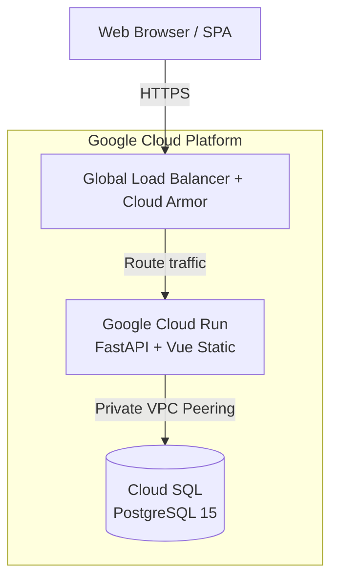

# 📝 SimpleTodo MVP

A robust, enterprise-grade TODO application built with **FastAPI** and **Vue 3**. This project emphasizes stability through **Optimistic Concurrency Control (OCC)**, **Task Dependencies**, and a rigorous **Test-Driven Development (TDD)** approach.

---

## 🚀 Features

- **Core CRUD**: Seamlessly create, read, update, and soft-delete tasks.
- **Task Dependencies**: Advanced guardrails prevent starting tasks until prerequisites are `Completed`.
- **Recurring Schedules**: Native support for **RFC 5545 RRULE** (Daily, Weekly, Monthly) with flexible calculation anchors (`DUE_DATE` vs. `COMPLETION_DATE`).
- **Optimistic Concurrency Control (OCC)**: Version-based locking ensures data integrity in multi-user environments, providing explicit conflict alerts and reactive state reconciliation.
- **Smart UI**: 
  - 🎨 **Visual Urgency**: Tasks are color-coded by due date (Red: Overdue, Yellow: Today, Green: Future).
  - 🔍 **Advanced Filtering**: Filter by status, priority, dependency state, and soft-delete status.
  - 📊 **Traditional Pagination**: Performant handling of 10,000+ items.
- **Background Processing**: Prerequisite status changes propagate automatically via FastAPI BackgroundTasks with built-in retry logic.

---

## 🛠 Tech Stack

| Layer | Technologies |
| :--- | :--- |
| **Frontend** | Vue 3 (Composition API), Vite, Tailwind CSS, Vitest |
| **Backend** | Python 3.11, FastAPI, SQLAlchemy 2.0, Pydantic v2, Alembic |
| **Database** | PostgreSQL 15 |
| **Infra** | Docker Compose, Terraform, Google Cloud Run |

---

## 💻 Local Development

### Prerequisites
- Docker & Docker Compose installed.
- (Optional) Node.js & Python 3.11 for native testing.

### Quick Start (Clean State)
1. **Configure Environment**:
   ```bash
   cp projects/example-todo-app/.env.example projects/example-todo-app/.env
   ```
2. **Launch Services**:
   ```bash
   cd projects/example-todo-app
   docker compose up -d --build
   ```
3. **Initialize Database**:
   Wait for the database container to be ready, then execute:
   ```bash
   docker compose exec api sh -c "until cd backend && alembic upgrade head; do echo 'Waiting for DB...' && sleep 2; done"
   ```
4. **Access the App**:
   - **Unified UI**: [http://localhost:8000/](http://localhost:8000/)
   - **Interactive API Docs**: [http://localhost:8000/docs](http://localhost:8000/docs)

### Developer Workflow (HMR)
For active frontend development with Hot Module Replacement:
1. Ensure the backend is running (port 8000).
2. Start the Vite dev server:
   ```bash
   cd projects/example-todo-app/frontend
   npm install
   npm run dev -- --port 8080 --host
   ```
3. Preview port `8080`.

---

## 🧪 Testing & TDD

This project follows a **strict TDD methodology**. Every bug fix and feature implementation begins with a failing test case to establish a requirement-driven baseline.

### Backend Tests (Pytest)
Verified via a comprehensive suite covering Models, CRUD, API Handlers, and Edge Cases (OCC conflicts, circular dependencies).
```bash
docker compose exec api pytest backend/tests
```

### Frontend Tests (Vitest)
Unit and integration tests for Components, Composables, and API integration, ensuring robust UI state management.
```bash
cd frontend && npm install && npm run test
```

### Test Coverage (Current)
| Component | Coverage |
| :--- | :--- |
| **Backend (app/)** | **92%** |
| **Frontend (src/)** | **83%** |

---

## ☁️ Cloud Deployment (GCP)

This project is designed for a **Single-Container Hybrid Deployment Strategy** on Google Cloud Run.

### 1. Environment Setup
Set these variables in your terminal:
```bash
export PROJECT_ID="your-project-id"
export REGION="asia-east2"
export DB_INSTANCE_NAME="todo-db-instance"
export DB_NAME="todo_db"
export DB_USER="todo_user"
export DB_PASS="your-secure-password"
export SERVICE_NAME="simpletodo-app"
export REPO_NAME="simpletodo-repo"
```

### 2. Infrastructure Initialization
```bash
# Enable APIs
gcloud services enable run.googleapis.com sqladmin.googleapis.com \
    artifactregistry.googleapis.com cloudbuild.googleapis.com secretmanager.googleapis.com

# Create Cloud SQL Instance
gcloud sql instances create $DB_INSTANCE_NAME \
    --database-version=POSTGRES_15 --tier=db-f1-micro --region=$REGION --root-password=$DB_PASS

# Create Database & User
gcloud sql databases create $DB_NAME --instance=$DB_INSTANCE_NAME
gcloud sql users create $DB_USER --instance=$DB_INSTANCE_NAME --password=$DB_PASS
```

### 3. Secret & IAM Configuration
```bash
# Store Connection String
INSTANCE_CONNECTION_NAME=$(gcloud sql instances describe $DB_INSTANCE_NAME --format='value(connectionName)')
DATABASE_URL="postgresql://$DB_USER:$DB_PASS@/$DB_NAME?host=/cloudsql/$INSTANCE_CONNECTION_NAME"
echo -n $DATABASE_URL | gcloud secrets create DATABASE_URL --data-file=-

# Grant Access to Cloud Run Service Account
PROJECT_NUMBER=$(gcloud projects describe $PROJECT_ID --format='value(projectNumber)')
RUN_SA="$PROJECT_NUMBER-compute@developer.gserviceaccount.com"

gcloud secrets add-iam-policy-binding DATABASE_URL \
    --member="serviceAccount:$RUN_SA" --role="roles/secretmanager.secretAccessor"

gcloud projects add-iam-policy-binding $PROJECT_ID \
    --member="serviceAccount:$RUN_SA" --role="roles/cloudsql.client"
```

### 4. Build & Deploy
```bash
# Create Repository
gcloud artifacts repositories create $REPO_NAME --repository-format=docker --location=$REGION

# Build & Push
IMAGE_TAG="$REGION-docker.pkg.dev/$PROJECT_ID/$REPO_NAME/$SERVICE_NAME:latest"
gcloud builds submit --tag $IMAGE_TAG .

# Deploy to Cloud Run
gcloud run deploy $SERVICE_NAME \
    --image $IMAGE_TAG --region $REGION \
    --set-secrets "DATABASE_URL=DATABASE_URL:latest" \
    --add-cloudsql-instances $INSTANCE_CONNECTION_NAME \
    --set-env-vars "APP_ENV=production" --allow-unauthenticated
```

### 5. Database Migrations
Run the migrations using a Cloud Run Job:
```bash
gcloud run jobs create migration-job \
    --image $IMAGE_TAG --region $REGION \
    --set-secrets "DATABASE_URL=DATABASE_URL:latest" \
    --set-cloudsql-instances $INSTANCE_CONNECTION_NAME \
    --command "sh" --args="-c,cd backend && alembic upgrade head"

gcloud run jobs execute migration-job --region $REGION --wait
```

---

## 🧹 Cleanup & Troubleshooting

### Local Reset
To stop the application and wipe all persistent data (volumes, networks):
```bash
docker compose down -v
rm projects/example-todo-app/test.db  # Purge local SQLite test DB
```

### GCP Cleanup
To tear down all cloud resources:
```bash
# Delete Cloud Run Service & Job
gcloud run services delete $SERVICE_NAME --region $REGION --quiet
gcloud run jobs delete migration-job --region $REGION --quiet

# Delete Infrastructure
gcloud sql instances delete $DB_INSTANCE_NAME --quiet
gcloud artifacts repositories delete $REPO_NAME --location $REGION --quiet
gcloud secrets delete DATABASE_URL --quiet
```

### Common Issues
- **409 Conflict Alert**: This occurs when the task version in your browser is stale. The app will automatically refresh your state upon dismissal.
- **Port 8000 Conflict**: Ensure no other local services (like standalone FastAPI or Uvicorn) are occupying the port before starting Docker.

---

## 🔭 Future Architectural Considerations

While the current MVP successfully delivers a robust, single-tenant concurrency model, scaling this to an enterprise-grade SaaS platform requires several architectural evolutions:

**1. Multi-Tenancy & Identity Access Management (IAM)**
* **Technical Considerations:** Implementing user authentication requires evolving the data model to include `tenant_id` mapping. On the application tier, it necessitates robust session management (or stateless JWTs), secure credential hashing, and strict application-level data segregation to ensure users can only query and mutate their own tasks.

**2. Event-Driven State Synchronization (Real-Time Updates)**
* **Technical Considerations:** Moving from OCC-driven polling to real-time sync across browser tabs requires an event-driven paradigm (WebSockets/SSE). This introduces the need for a message broker (e.g., Pub/Sub) and strict event-handling mechanics: managing out-of-order message delivery, ensuring idempotency, and implementing Dead Letter Queues (DLQs) to gracefully handle retries without UX degradation.

**3. Hierarchical Data & Batch Mutations (Bulk Operations)**
* **Technical Considerations:** Executing bulk state mutations (e.g., "Complete all tasks in Group A") requires the data model to support 1-to-many junction hierarchies. Providing a safe UX for this requires an "Undo" capability. Reverting a bulk operation requires restoring each child task to its exact *previous* status (rather than a blanket toggle), necessitating an event-sourcing pattern or audit log table.

---

## 🚀 DevOps & CI/CD Pipeline

To ensure the rigorous Test-Driven Development (TDD) standards maintained during local development translate to production, the deployment lifecycle is governed by automated CI/CD pipelines (configurable via `cloudbuild.yaml` or `.gitlab-ci.yml`).

### Pipeline Stages
1. **Static Analysis & Linting**: Enforcing Python (Ruff/Black) and TypeScript (ESLint) standards.
2. **Automated Unit Testing**: 
   - Backend: Execution of the `pytest` suite against an ephemeral SQLite/Postgres container.
   - Frontend: Execution of the `vitest` suite with JSDOM.
3. **E2E Simulation**: Utilizing Chrome DevTools Protocol (via MCP server integration) to simulate actual browser interaction and validate DOM state reconciliation during OCC conflicts.
4. **Immutable Build & Push**: Compiling the Vue SPA into the FastAPI static directory and building a single, immutable Docker image pushed to Google Artifact Registry.

---

## 🛡️ Security & Observability

Operating at scale requires shifting from local debugging to robust cloud observability and edge security.

* **Edge Security (API Gateway / Load Balancer):** - Routing traffic through an API Gateway or Global HTTP(S) Load Balancer.
  - Integration with **Google Cloud Armor** to provide WAF capabilities and DDoS protection.
  - API-level rate limiting and centralized authentication token validation before traffic ever hits the compute instances.
* **Runtime Observability (Cloud Run):**
  - Leveraging native Google Cloud Logging and Cloud Trace for application telemetry.
  - **Metrics:** Tracking P50/P95/P99 latency percentiles and 4xx/5xx error rates to monitor OCC collision frequencies.
  - **Logging:** Structured JSON logging bridging FastAPI request IDs to distributed traces for rapid bottleneck diagnosis.

---

## ☁️ Cloud Architecture (GCP)

For the current non-streaming, stateless REST architecture, a **Cloud Run** + **Cloud SQL** pattern provides the optimal balance of auto-scaling capability, zero-downtime deployments, and operational simplicity.



**Architectural Benefits:**
* **Scale-to-Zero:** Cloud Run automatically scales container instances based on concurrent request volume, optimizing cost.
* **Network Isolation:** Cloud SQL is deployed on a private IP within a VPC network. Cloud Run accesses the database via Serverless VPC Access, ensuring the database is never exposed to the public internet.
* **Simplified CORS:** Because Cloud Run serves both the Vue frontend assets and the FastAPI endpoints from the exact same origin, complex CORS preflight (`OPTIONS`) configurations are entirely eliminated at the infrastructure level.

---

## 📁 Project Structure

- `backend/app/`: FastAPI logic, models, and background tasks.
- `backend/migrations/`: Alembic database version history.
- `frontend/src/components/`: Modular UI elements (FilterBar, TaskItem, RRuleGenerator).
- `frontend/src/composables/`: Shared reactive business logic (`useTasks`).
- `docs/superpowers/plans/`: Historical implementation plans for auditability.
